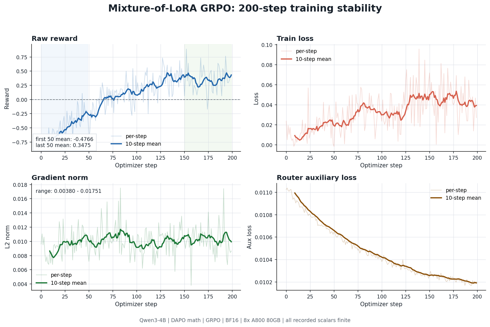
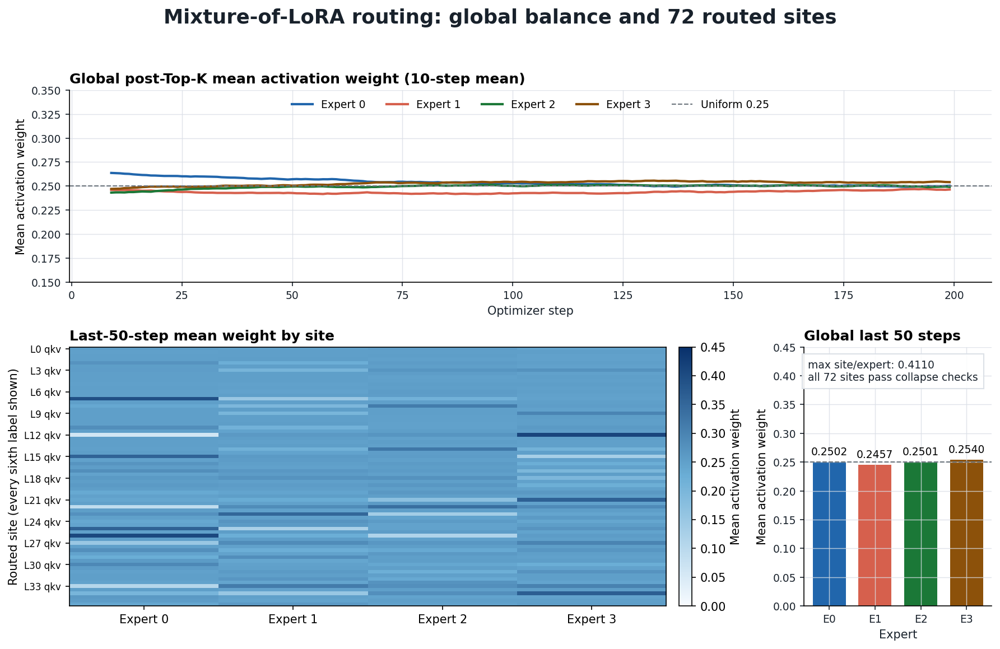
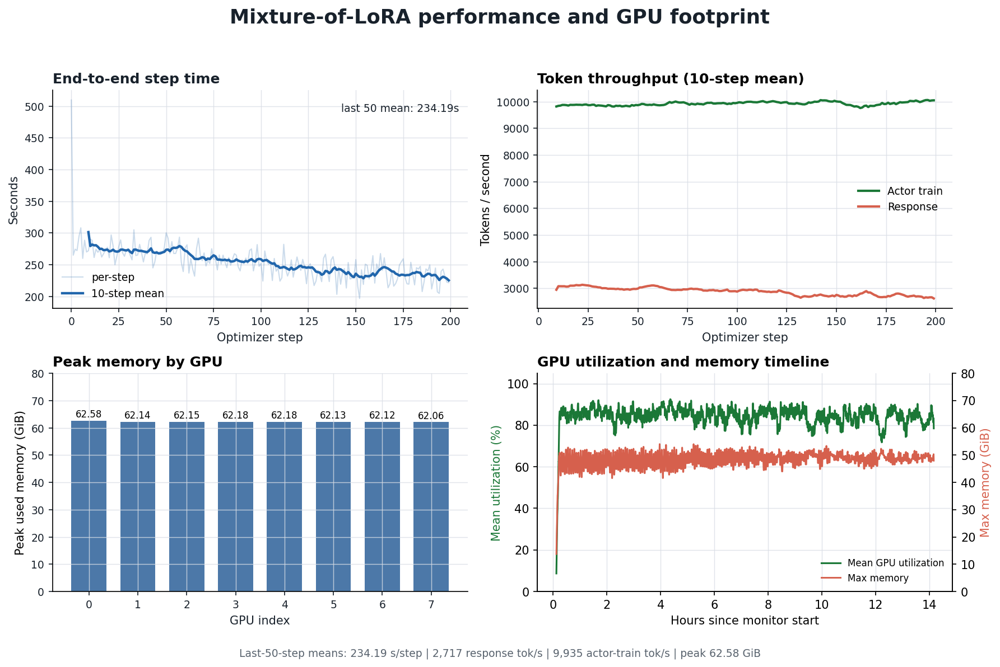
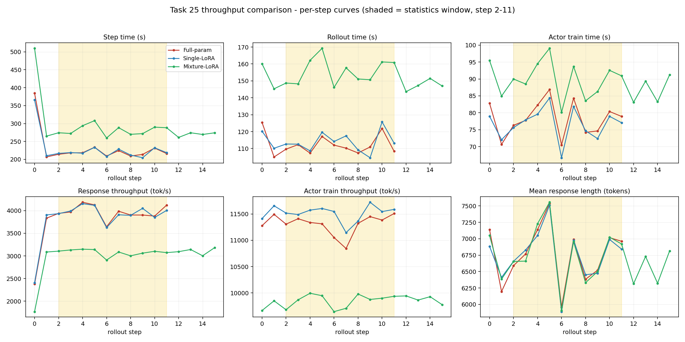
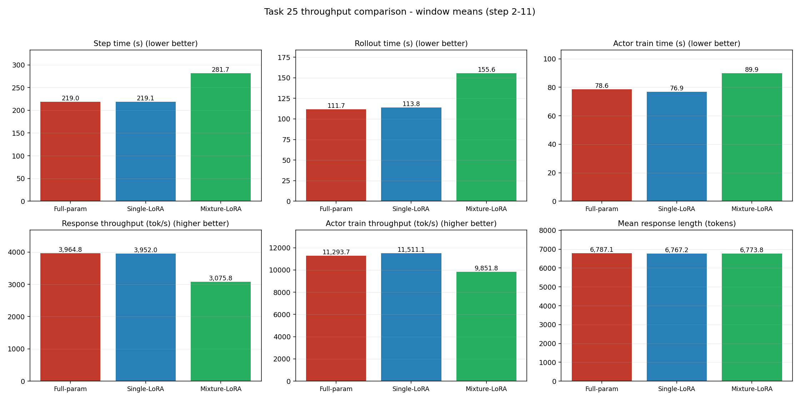
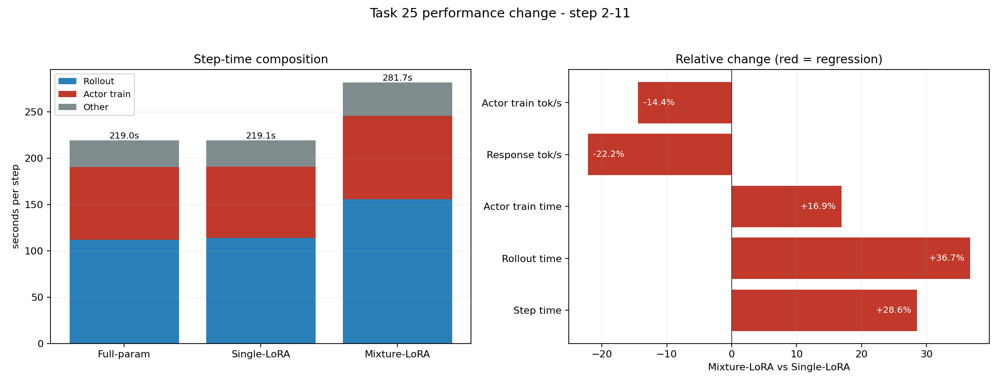
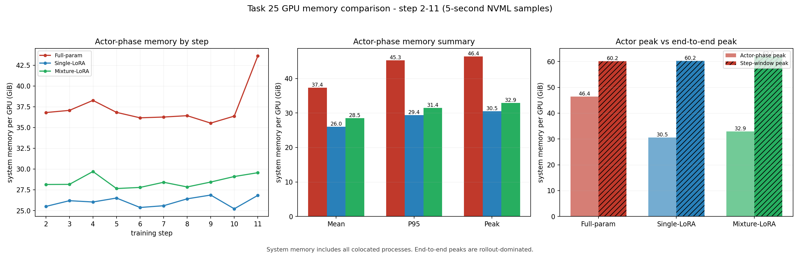

# Task 25 Mixture-of-LoRA 实验材料

该分支保存 Task 25 的公开实验结果，不包含训练 checkpoint、内部运行路径、机器标识、
网络配置、Ray job ID 或环境编排日志。

## 200-step 主实验

- 配置：Qwen3-4B、DAPO math、GRPO、colocate、BF16、8×A800 80GB。
- Mixture：4 experts、rank 16、Top-K 2。
- 结果：连续完成 200 step，全部 scalar 无 NaN/Inf，最后 50 step 的 72 个 routed
  site 均未塌缩到单一 expert。
- 报告：[`mixture-200step/experiment-report.md`](mixture-200step/experiment-report.md)
- 指标：[`mixture-200step/logs/200step-metrics.csv`](mixture-200step/logs/200step-metrics.csv)

## 补充验收

- CUDA：原始验收的 3 个定向用例全部通过；合并最新 `main` 后，Task 25 Megatron CUDA
  测试为 61 passed。
- Checkpoint：从 iteration 49 恢复完整训练和数据状态，继续完成 step 50–52。
- 性能：全参、单 LoRA、Mixture-LoRA 统一统计 step 2–11。
- 总览：[`followup/README.md`](followup/README.md)
- 吞吐数据：[`followup/results/three-way-window-2-11.json`](followup/results/three-way-window-2-11.json)
- Actor 阶段显存：[`followup/results/actor-memory-window-2-11.json`](followup/results/actor-memory-window-2-11.json)

## 图片

### 200-step 训练稳定性

### Expert 路由

### 200-step 显存与吞吐

### 三组逐步曲线

### 三组窗口均值

### Mixture 性能变化

### Actor 阶段与端到端显存

